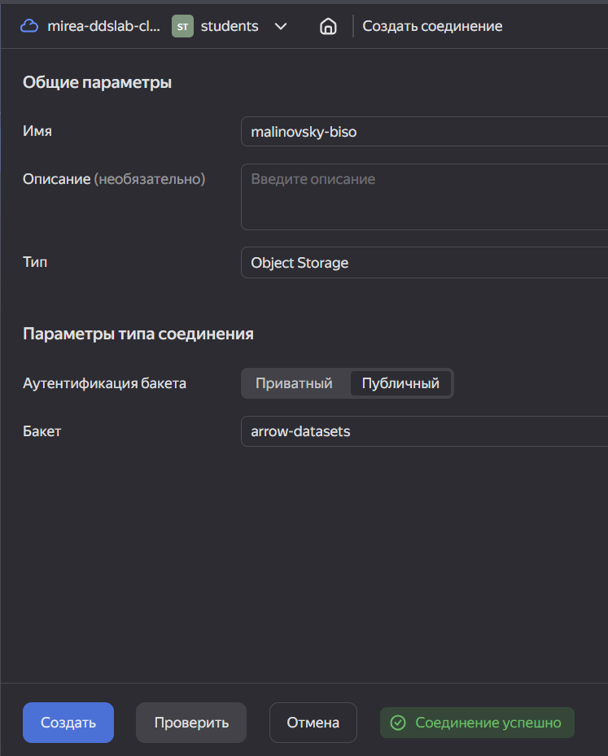
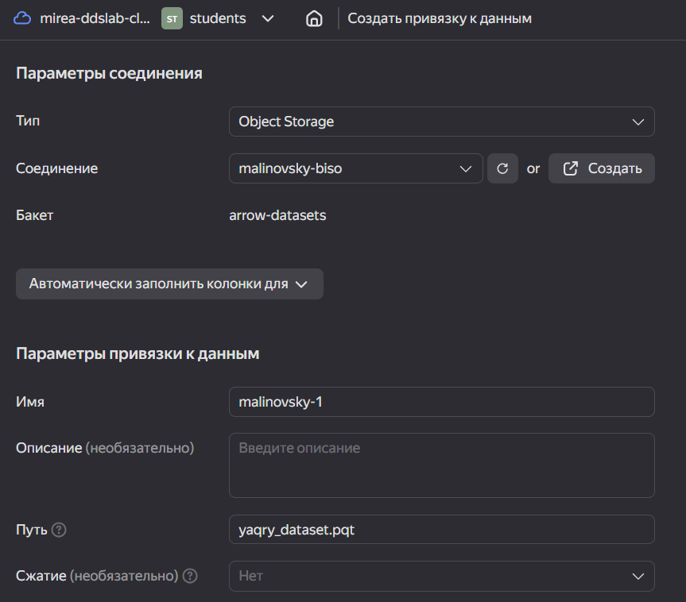
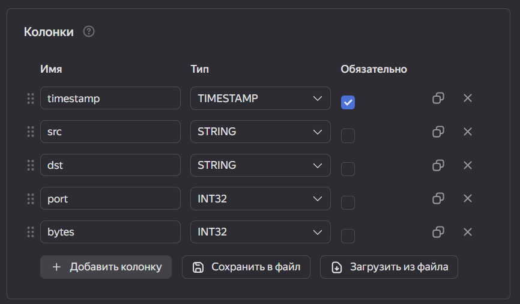
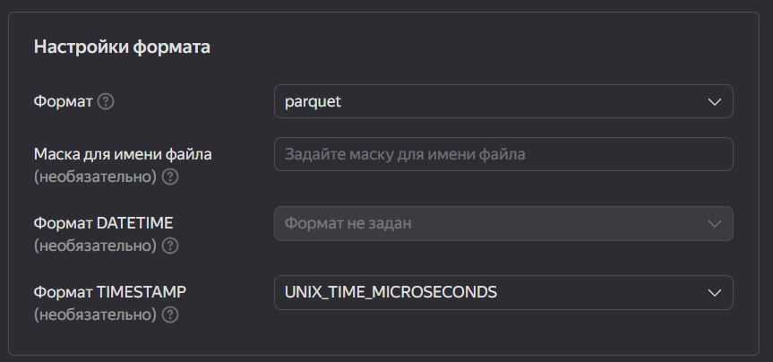
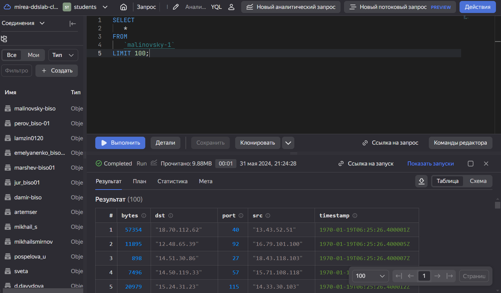
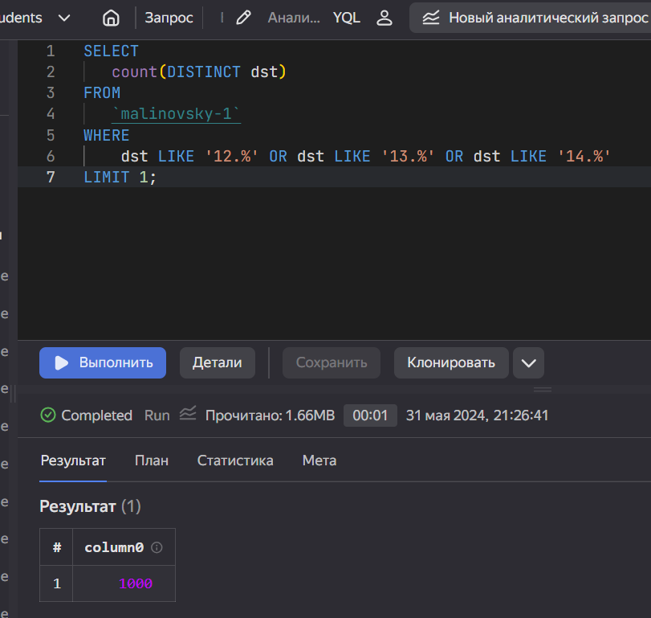
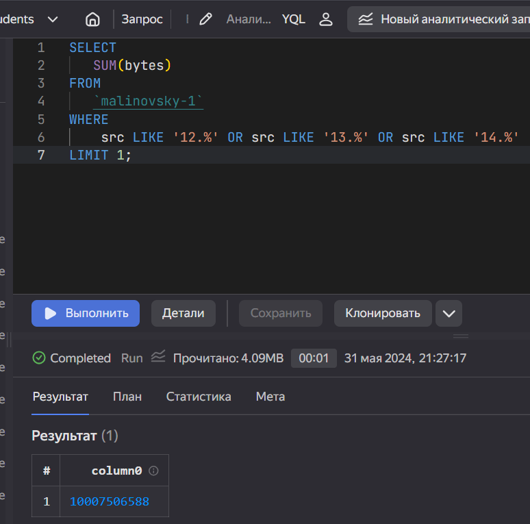
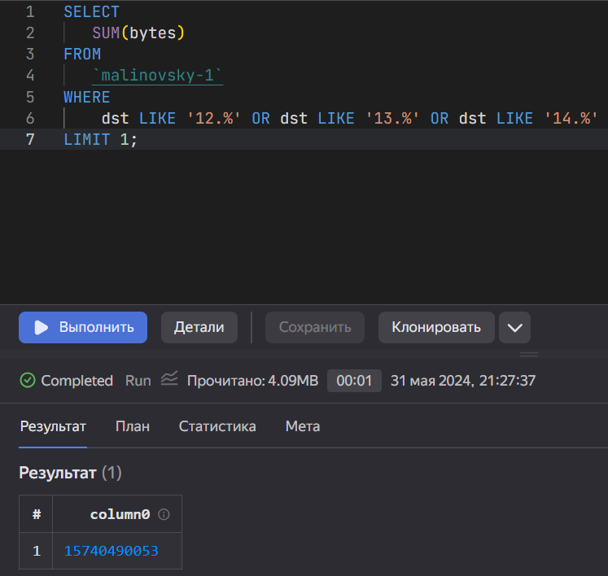

Practical task No. 1
================
Artyom Malinovsky

# Использование технологии Yandex Query для анализа данных сетевой активности

## Цель работы

1.  Изучить возможности технологии Yandex Query для анализа
    структурированных наборов данных
2.  Получить навыки построения аналитического пайплайна для анализа
    данных с помощью сервисов Yandex Cloud
3.  Закрепить практические навыки использования SQL для анализа данных
    сетевой активности в сегментированной корпоративной сети

## Исходные данные

1.  Ноутбук с ОС Windows 10
2.  RStudio
3.  Yandex Cloud
4.  Yandex Query

## Задание

Используя сервис Yandex Query настроить доступ к данным, хранящимся в
сервисе хранения данных Yandex Object Storage. При помощи
соответствующих SQL запросов ответить на вопросы.

## Ход работы

### 1. Проверить доступность данных в Yandex Object Storage.

Проверим доступность данных `(файл yaqry_dataset.pqt)` в бакете
`arrow-datasets` S3 хранилища Yandex Object Storage. Проверить можно
просто перейдя по правильно сконструированному URL в браузере.

    https://storage.yandexcloud.net/arrow-datasets/yaqry_dataset.pqt

### 2. Подключить бакет как источник данных для Yandex Query.

#### 1) Создадим соединение для бакета в S3 хранилище.

Для создания соединения для бакета нужно зайти в Yandex Query =\> раздел
«Соединения» =\> кнопка «Создать»

#### 2) Заполняем поля с учетом допустимых символов, выбираем тип аутентификации – публичный. Вводим имя бакета в соответствующее поле и сохраняем.

#### 3) Укажем какой объект использовать в качестве источника данных. Для этого нужно сделать привязку данных.

Имя задаём произвольно с учётом допустимых символов. В путь вписываем
название файла `yaqry_dataset.pqt`. Формат указываем `parquet`, а формат
TIMESTAMP (он будет доступен после описания колонок входных данных) -
`UNIX_TIME_MICROSECONDS`.

Далее нам
нужно задать значение в колонках.

    SCHEMA=(
    timestamp TIMESTAMP NOT NULL,
    src STRING,
    dst STRING,
    port INT32,
    bytes INT32
    )

#### 4) Сделаем пробный аналитический запрос.

Если настройка выполнена правильно, то запрос выдаст нам таблицу из 100
строк.

## Анализ

### 1. Известно, что IP адреса внутренней сети начинаются с октетов, принадлежащих интервалу \[12-14\]. Определите количество хостов внутренней сети, представленных в датасете.

    SELECT
       count(DISTINCT dst)
    FROM
       `malinovsky-1`
    WHERE
        dst LIKE '12.%' OR dst LIKE '13.%' OR dst LIKE '14.%'
    LIMIT 1;

``` r
print ("Количество хостов внутренней сети = 1000")
```

    [1] "Количество хостов внутренней сети = 1000"



### 2. Определите суммарный объем исходящего трафика

    SELECT
       SUM(bytes)
    FROM
       `malinovsky-1`
    WHERE
        src LIKE '12.%' OR src LIKE '13.%' OR src LIKE '14.%'
    LIMIT 1;

``` r
print ("Cуммарный объем исходящего трафика = 10007506588 байт")
```

    [1] "Cуммарный объем исходящего трафика = 10007506588 байт"



### 3. Определите суммарный объем входящего трафика

    SELECT
       SUM(bytes)
    FROM
       `malinovsky-1`
    WHERE
        dst LIKE '12.%' OR dst LIKE '13.%' OR dst LIKE '14.%'
    LIMIT 1;

``` r
print ("Cуммарный объем входящего трафика = 15740490053 байт")
```

    [1] "Cуммарный объем входящего трафика = 15740490053 байт"



## Оценка результатов

Задача по проведению анализа сетевой активности была выполнена при
помощи облачных сервисов Yandex Cloud и технологии Yandex Query. В ходе
работы удалось познакомиться с функционалом данных сервисов и освоить
базовые навыки работы с ним.

## Вывод

Были решены задачи с помощью языка SQL, а также облачных сервисов Yandex
Cloud и технологии Yandex Query. Были освоены и закреплены практические
навыки использования SQL для анализа данных сетевой активности.
