Practical task No. 2
================
Artyom Malinovsky

# Использование технологии Yandex DataLens для анализа данных сетевой активности

## Цель работы

1.  Изучить возможности технологии Yandex DataLens для визуального
    анализа структурированных наборов данных
2.  Получить навыки визуализации данных для последующего анализа с
    помощью сервисов Yandex Cloud
3.  Получить навыки создания решений мониторинга/SIEM на базе облачных и
    открытых программных решений
4.  Закрепить практические навыки использования SQL для анализа данных
    сетевой активности в сегментированной корпоративной сети

## Исходные данные

1.  Ноутбук с ОС Windows 10
2.  RStudio
3.  Yandex Cloud
4.  Yandex DataLens

## Задание

Используя сервис Yandex DataLens настроить доступ к результатам Yandex
Query, полученным в ходе выполнения практической работы №1, и визуально
представить результаты анализа данных.

### Поставленные задачи

1.  Представить в виде круговой диаграммы соотношение внешнего и
    внутреннего сетевого трафика.
2.  Представить в виде столбчатой диаграммы соотношение входящего и
    исходящего трафика из внутреннего сетвого сегмента.
3.  Построить график активности (линейная диаграмма) объема трафика во
    времени.
4.  Все построенные графики вывести в виде единого дашборда в Yandex
    DataLens.

## Ход работы

### 1. Настроить подключение к Yandex Query из DataLens

-   Первым делом перейдём в сервис Yandex DataLens
    (https://datalens.yandex.ru/) и перейдём по пути «Подключения» =\>
    «Создать подключение» =\> «Yandex Query».

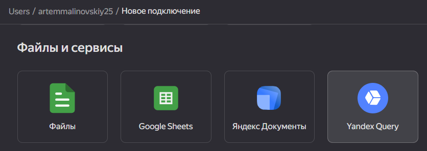

-   Используем уже существующий сервисный аккаунт
    `students-datalens-query`.

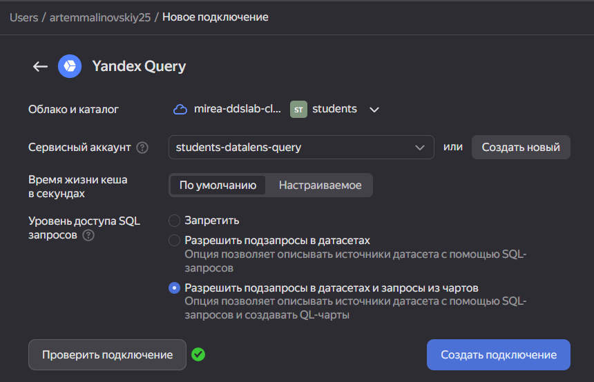

-   Задаём название нашего подключения и заметим, что оно появилось в
    нашем списке.

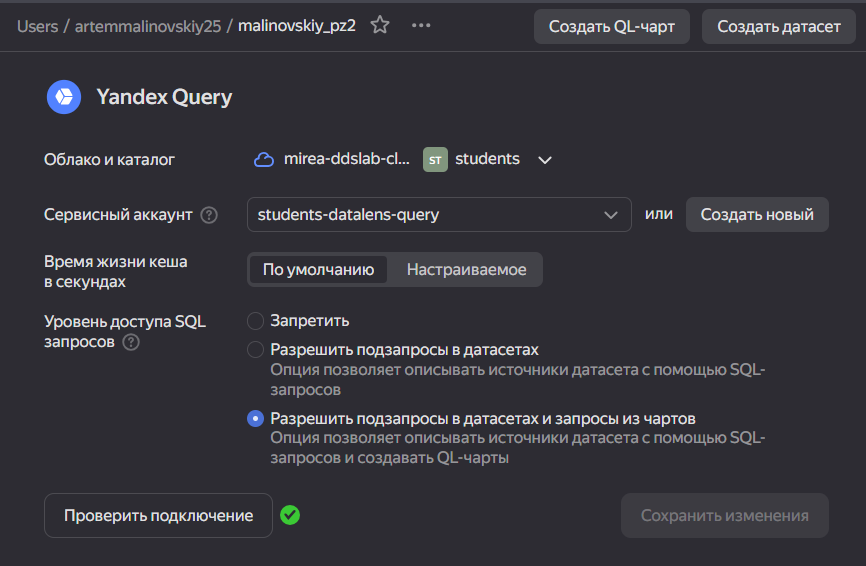

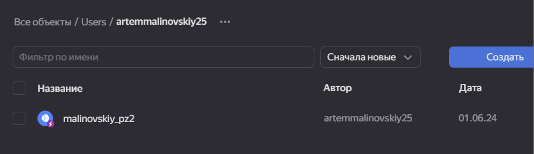

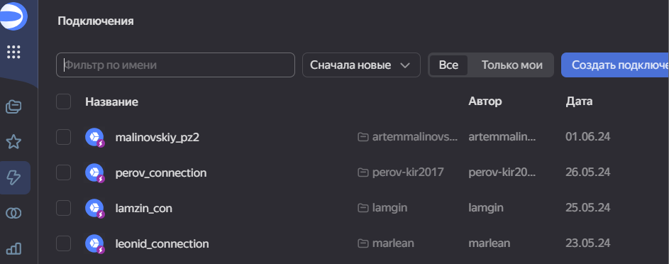

### 2. Создать из запроса YandexQuery датасет DataLens

-   Первым делом перейдём во вкладку «Датасеты» =\> «Создать датасет».
    Выбираем наше подключение и среди доступных таблиц перетаскиваем в
    рабочую область наш доступный запрос как выбранный датасет.

Внизу можем заметить, что нам стал доступен предпросмотр датасета с
возможностью выбора количества отображаемых строк.

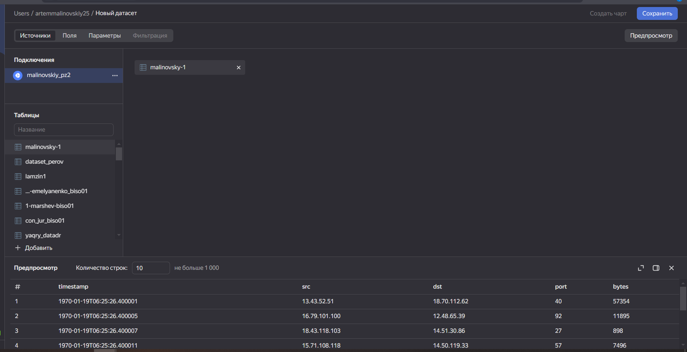

-   Задаём название нашего датасета и заметим, что оно появилось в нашем
    списке.

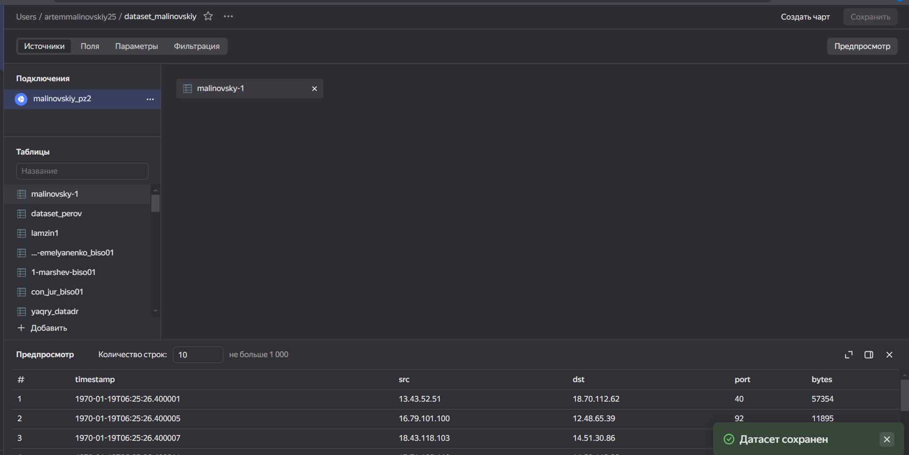

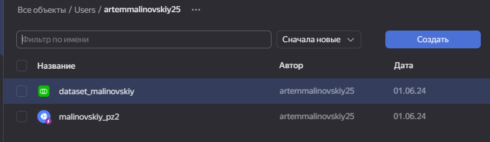

### 3. Делаем нужные графики и диаграммы

-   В DataLens графики и диаграммы называются чартами. Перейдём во
    вкладку «Чарты» =\> «Создать чарт» =\> «Чарт». Далее выбираем
    данные, тип диаграммы и исходные данные.

<!-- -->

-   Создадим первую круговую диаграмму соотношения внешнего и
    внутреннего сетевого трафика. Помним, что IP адреса внутренней сети
    начинаются с 12-14 октетов.

    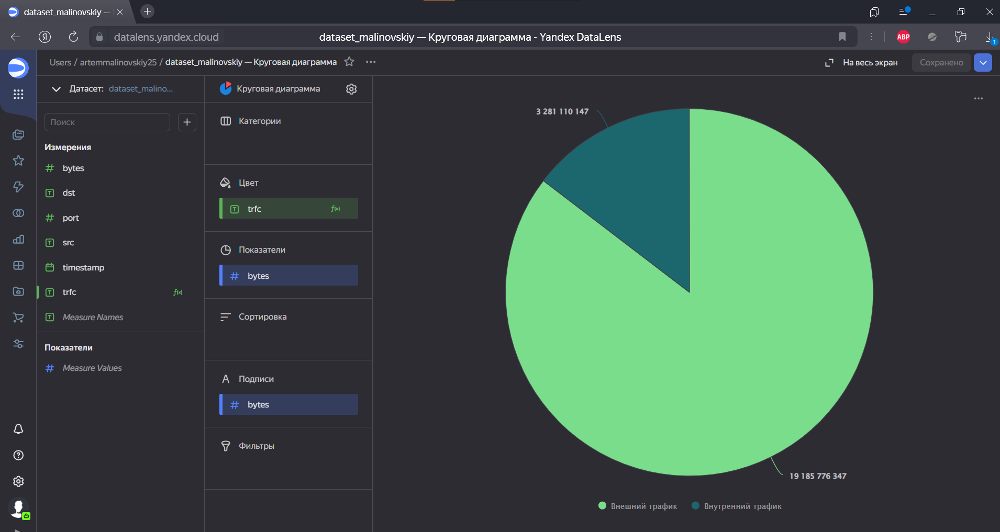

``` r
print("Внутренний трафик ≈ 3.06 ГБ")
```

    [1] "Внутренний трафик ≈ 3.06 ГБ"

``` r
print("Внешний трафик ≈ 14.37 ГБ")
```

    [1] "Внешний трафик ≈ 14.37 ГБ"

-   Создадим вторую столбчатую диаграмму соотношения входящего и
    исходящего трафика из внутреннего сетевого сегмента организации.
    Помним, что IP адреса внутренней сети начинаются с 12-14 октетов.

**Созданные поля:**

Измерение trfc для разделения входящего и исходящего трафика.

    IF (LEFT([src], 3) IN ('12.', '13.', '14.') AND LEFT([dst], 3) NOT IN ('12.', '13.', '14.'))
        THEN 'Исходящий трафик'
    ELSEIF (LEFT([dst], 3) IN ('12.', '13.', '14.') AND LEFT([src], 3) NOT IN ('12.', '13.', '14.'))
        THEN 'Входящий трафик'
    ELSE
        NULL
    END

``` r
print("Входящий трафик ≈ 12.5 ГБ")
```

    [1] "Входящий трафик ≈ 12.5 ГБ"

``` r
print("Исходящий трафик ≈ 6.7 ГБ")
```

    [1] "Исходящий трафик ≈ 6.7 ГБ"

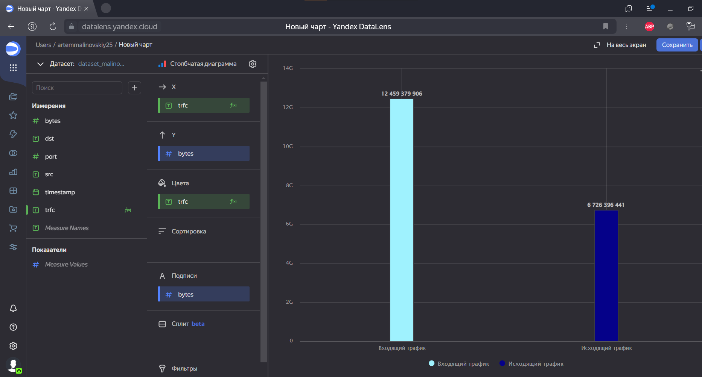

-   Создадим третью линейную диаграмму графика активности объема трафика
    во времени входящего и исходящего трафика из внутреннего сетевого
    сегмента организации. Помним, что IP адреса внутренней сети
    начинаются с 12-14 октетов.

**Созданные поля:**

Измерение `time_sec` для подсчёта трафика по секундам

    SECOND([timestamp])

Измерение `bytes3` для разметки цвета

    IF (LEFT([src], 3) IN ('12.', '13.', '14.') 
        AND 
        LEFT([dst], 3) NOT IN ('12.', '13.', '14.'))
        THEN 'Исходящий трафик'
    ELSEIF (LEFT([dst], 3) IN ('12.', '13.', '14.') 
        AND 
        LEFT([src], 3) NOT IN ('12.', '13.', '14.'))
        THEN 'Входящий трафик'
    ELSE
        'Неопознаный трафик'
    END

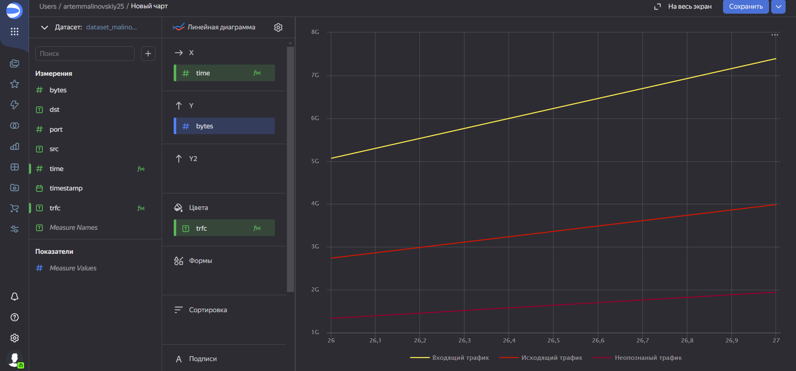

### 4. Сделаем дашборд из ранее созданных чартов.

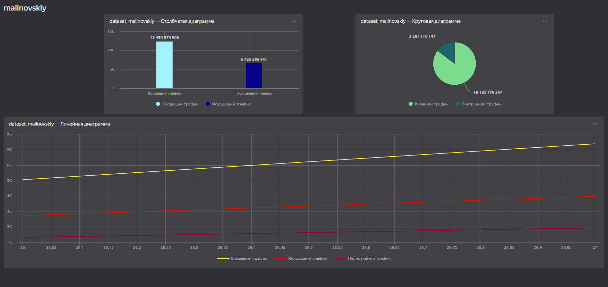***Ссылка на дашборд:***
https://datalens.yandex.cloud/rb0qqccqtoh2f-malinovskiy

## Оценка результатов

С помощью технологии `Yandex DataLens` было создано несколько чартов с
графиками, которые были основаны на предоставленном наборе данных, а
также был создан дашборд, объединяющий эти чарты в единый визуальный
формат.

## Вывод

Были изучены возможности `Yandex DataLens` для визуального анализа
структурированных наборов данных. Получены навыки анализа данных на базе
`Yandex Cloud`. Закреплены практические навыки использования
SQL-запросов для анализа данных сетевой активности в сегментированной
корпоративной сети.
